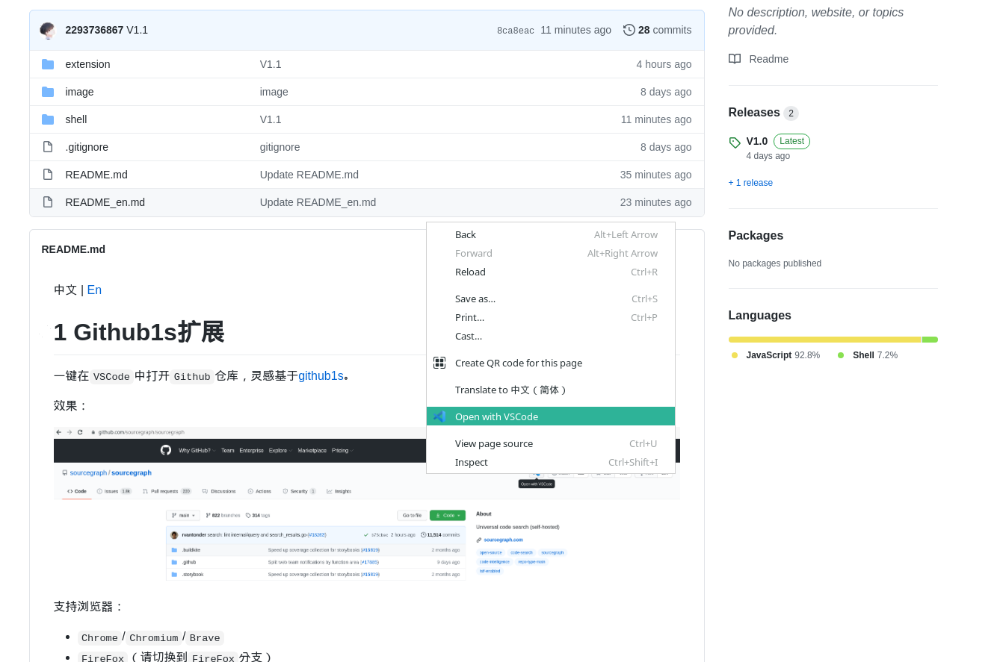

[中文](https://github.com/2293736867/Github1sExtension/blob/main/README.md) | En

# 1 Github1sExtension

One second to read GitHub code with VS Code.

Screenshot:




Supported browser:

- `Chrome`/`Chromium`/`Brave`
- `FireFox`(Please switch branch `FireFox`)

# 2 Install

## 2.1 Extension

Download `Chrome.crx` in `Release` page and Drag the `crx` file to the browser.

(`Brave` users please download and extract `Chrome.zip` in `Release` page because of some unknown safe reasons, installed by `Load unpacked` in extension management page)

## 2.2 `CLI`

Download `g1s.sh` in `Release` page and place it in a fiexd position, and add an alias:

```bash
alias g1s='sh xxxxx/g1s.sh'
```
After that you can use `g1s` command.

There are two ways to use it right now:

- `cd` local `git` repository and input `g1s`
- Enter `g1s username repository` directly, for example open this repository by entering `g1s 2293736867 Github1sExtension` 

# 3 Distribute

There is a plan for distributing it, but it may take some time due to the author's own reason.

# 4 License

MIT

# 5 Log

## 2/21/2021

- V1.1
- Context menus and basic `CLI`
- Change icon

## 2/13/2021

- V1.0
- Basic function
